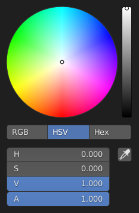
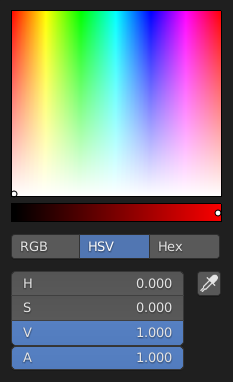
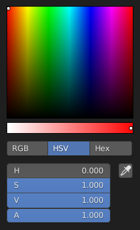
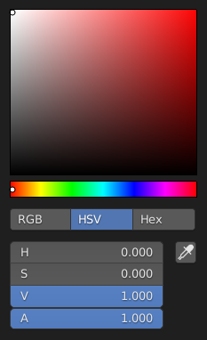

# Color

Color isn't a simple concept. That's because is is essentially a perceptual phenomenon, created by our brain. It is the result of the stimulation of three specific types of cells within the retina. Normally with light of a certain frequency. But, it doesn't need to be light. It can also easily be triggered by other stimuli; e.g. pressure on the eyeball. Color is thus not an inherent property of light but the result of the interaction between our brain and light. Many of the technical implementation details of color in our computers and their associated problems cannot be fully understood without this link to the human eye and brain.

For example, Blender has 5 alternative color pickers. You can choose one of them with Edit > Preferences > Interface. They all look very similar, yet also a bit different. Why? And why do we need 5 of them? And what is the meaning of those abbreviations like RGB, HSV, HSL, Hex? And does it matter if you choose one or the other to pick a color? And, why is there a little warning ('Gamma corrected') underneath the Hex selection? Are the other not gamma-corrected? The sliders (H, S, ...) suggest that you can enter a value between 0 and 1. This is true for most of them but with a few you can enter values > 1. What do those values mean? ...

## Color model

RGB, HSV and HSL are color models: mathematical descriptions of color. Hex is an alternative but outdated notation for the RGB model. These models define a color according to three attributes. Red, green and blue for the RGB model. Hue, Saturation, and Value or Lightness for the HSV or HSL model.

The RGB color model is derived from the inner workings of the human eye. The color-sensitive cells in the retina belong to three groups: red-sensitive, green-sensitive, and blue-sensitive cells. A computer display mimics this organization by providing each pixel with red-, green-, and blue-light emitting led's. So, if you want a red display, turn on the red LED's. But, what if you want another color, say yellow. As you can see from figure 2, yellow has a spectral frequency of xxx nm, and thus stimulates the red and green-sensitive cells more or less equally. The output of these two cells is integrated in our brain to create the yellow perception. So, if you want yellow on the display, you have to turn on both the red and green LED's. The light rays of these led's hit our color-sensitive cells at the back of the retina and initiate the color perception.

The RGB color model is thus an additive model. New colors are created by adding the three primary colors in various quantities. Adding red and green gives us yellow, red and blue forms magenta and green and blue results in cyan. Undoubtedly, you have seen the additive diagrams as in figure 3.

So, let's try to test our understanding of the additive model by recreating those diagrams in Blender. That shouldn't be to hard, is it?

1. May be, you think, it's as easy as creating 3 overlapping circles and filling them with the appropriate colored material. That's not the case. Even if the circles are laying in the same plane, they look like stacked on top of each other in Eevee and mangled in Cycles. This is the result of Z-fighting. If a pixel at the intersection of the circles must be rendered, the camera can choose between two or three colors. The red face of the circle lays at equal distance as the the green or blue face. Eevee solves this dilemma by choosing always from the same face. Cycles chooses at random, with the mangled result. Changing the Z-coordinate with a very small amount suffice to change the stack order and remove the Z-fighting but of course, doesn't solve our problem of mixing the two colors.
2. The correct solution is probably to create three spot lights, each with a different color. 

venn-diagram in blender
- 3 circles with BSDF-shader material red, green, blue. Only see circle on top
- emmission shader: same result
- 3 lights with appropriate color: lights are invisible

With the three sliders R, G and B in the color picker you can control the intensity of the corresponding led's in the display. The RGB color model can be represented as a coordinate system with three axes: R, G and B. The values along these axes represent the intensity of the light. The unit of measurement is less obvious. Pure physical, the origin should be zero (negative light energy does not exist, is it?) and the scale should be linear (until infinity). Two photons prodeuces double enegy of one photon. If we continu however with the analogy of the human eye, the origin should be the minimum intensity a person can see (of red, green, blue light) and at the other side of the axis the maximùum of energy a person is sensitive with a threshold unit.

A computer display contains numerous pixels and each pixel consists of 3 primary colors. Our eyes combine these primary colors into the perceived color.

The resulting color can be represented in a color model, such as the RGB Color Model or the HSV color model.
------------------------
Bit depth, or the quantity of “steps”, has no impact on the chromaticity of the primary lights, or tristimulus values, nor change the minimum or maximum emission of said lights. That is, it is like the number of slices we choose to slice up a banana; more slices isn’t going to make the banana an apple, nor make the banana longer or shorter.

RGB code values alone carry no additional context that explain what the values mean. We cannot examine an RGB triplet in isolation, no matter how accurate they appear, and know what they represent;

To give our code values meaning, we are going to hook them up to a display device. 

So what happens when we wrap up a code value and send it to our brand new sRGB display? If we send a code value of [1.0, 1.0, 1.0], do we have any idea how much light is coming out? 

The answer is yes, but we would need some metric. While there are quite a few of them out there, the one chosen by the standard is known as a candela per square metre². You may have heard it before, as some folks call it, somewhat colloquially, a nit. If you had the sRGB specification in front of you, you’d see that ideally, in a reference display, the output from an sRGB display is 80 nits. (all three channels set to max) 

A transfer function is a math formula that describes how a code value relates to light energy input or output.

Answer #9: Using a transfer function to nonlinearly encode data in accordance with a display referred output is nothing more than a compression scheme; it removes code values from the range of values that are redundant for our perceptual systems.

The qualia of a given mixture of visible light is quantifiable in an absolute sense using the model that maps visible light spectra to chromaticities, which starts with the CIE 1931 colour space model.

Remember that the slider represents the encoded value range of our display’s transfer function. That means that the values do not represent display linear light ratios, and the values do not even represent a perceptually uniform distribution as per Question #15. They are simply encoded values. That encoded value in turn will get decoded by the display, and turned into display linear light ratios.

chromaticity: property of a colour stimulus defined by its chromaticity coordinates, or by its dominant or complementary wavelength and purity taken together  (CIE). chromaticity coordinates: ratio of each of a set of 3 tristimulus values to their sum. As the sum of the 3 chromaticity coordinates is equal to 1, 2 of them are sufficient to define a chromaticity.

Saturation is the width of a wave form. A very narrow spike at a certain wave length gives a very saturated color. A wide wave form (containing many wave lengths) is less saturated and more towards the grey side.

break down the extremely complex idea of colour as representing the entire psychophysical phenomena of visible light experience, while chromaticity represents a very firm colour science model.

The missing axis when looking at the CIE 1931 chromaticity diagram is luminance, expressed as an uppercase Y. In this case, the CIE 1931 chromaticity diagram uses the lowercase x and y to represent normalized, or scaled from 0% to 100%, values. 